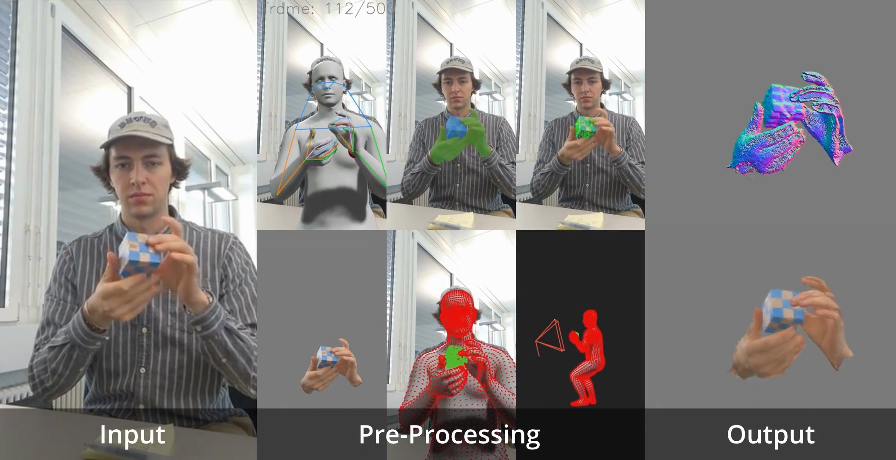

# Reconstructing Hand-Object Interactions with 3D Gaussian Splatting

<div align="center">


$\downarrow$



</div>

(See videos here: [Hand-Object Interaction](./assets/hold_gs_overview.mp4), [Human-Object Interaction](./assets/human_gs_overview.mp4))

## Overview

This project essentially evolved out of our initial goal, which was to outperform [HOLD](https://arxiv.org/pdf/2311.18448) in an identical experiment setting with a more versatile/efficient pipeline. To this end, we replace the neural rendering approach from implicit Signed-Distance-Fields with explicit ~~3D~~ 2D-Gaussian Splatting.

We achieve equal or better results than the baseline with a more simple and efficient approach (i.e. w/o modeling the background or jointly optimizing the H/O poses) & reduce training & rendering times from 12h -> 10min & 2 min/frame -> 60FPS respectively.

With respect to the hand/hand- object related metrics we see great improvements. In terms of object-related metrics we are slightly sub-par. That's because, unlike HOLD, our method can't fully reconstruct the object in regions that are always occluded.

Instead of focusing on in-hand/monocular occluded object reconstruction, we plan to extend the current pipeline to the two-hand case by replacing MANO with SMPL-X and evaluate its performance quantitatively on ARCTIC and qualitatively on in-the-wild videos (i.e. YouTube unboxing videos or similar).

<div align="center">

|                | CD (↓)  | CDₕ (↓)  | F₁₀ (↑)  | MPJPE (↓) |
| -------------- | ------- | -------- | -------- | --------- |
| Ø ours, latest | 0.64    | **4.06** | 92.78    | 25.7      |
| HOLD           | **0.4** | 11.3     | **96.5** | **24.2**  |

</div>

### Conclusion

We successfully migrated both the data & appearance pipelines to the human-object interaction scenario. To the best of our knowledge this is the first such work using `SMPLX` to reconstruct intricate hand-object interactions. (Bi-Manual HOI either uses two dis-joint `MANO` layers or simply `SMPL`.)

## Local Installation

> ⚠️ ******************************************************************** ⚠️

1. Clone this repo with the `--recursive` flag. This also clones the data pipeline its submodules.

    ```bash
    *****************************************************************************************
    *******************************
    ```

2. Setup the `handobjectreconstruction` environment.

    ```bash
    ./scripts/setup.sh
    ```

    If this fails, please install the dependencies manually. This environment is based on the conda environment from the `camera_motion` submodule & includes the dependencies for the data pipeline.

3. Setup the data pipeline

    ```bash
    cd datapipeline/submodules/camera_motion
    ```

    Continue here: [datapipeline/README.md](./datapipeline/README.md#L52).

   After processing a demo sequence, you should have the following folder structure:

    ```bash
    → tree datapipeline/data
    data
    └── demo
        ├── data.pt
        ├── masks.mp4
        ├── out.mp4
        └── video.mp4
    ```

    Let's link the data folder to the root directory.

    ```bash
    ln -s datapipeline/data data
    ```

    Alternatively, unzip `./assets/demo.zip` to `./data/demo` to skip the preprocessing pipeline.

    ```bash
    unzip assets/demo.zip -d data/
    ```

4. Add third-party files

    `MANO_SMPLX_vertex_ids.pkl` & `SMPL-X__FLAME_vertex_ids.npy` are missing missing in the `model_registry`. Download these files from the [SMPL-X Website](https://smpl-x.is.tue.mpg.de) & add them to `./assets/`.

    `[Optional]` Create a `.env` file with your `COMET_API_KEY=******` to monitor experiments online.

5. Run the demo.

    `NOTE:` On the first run `gsplat` is compiled, which might take a few minutes.

    ```bash
    python train.py
    ```

    `COMMENT:` This command loads `./configs/debug_fast.yaml`, which can be used to verify the appearance-training procedure.
