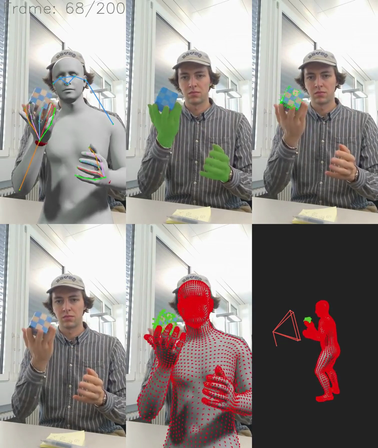

# Data Pre-Processing

<div align="center">
  
</div>

This repository contains the data pre-processing pipeline for the `3DGS`-based human-object reconstruction pipeline. Given a `video.mp4`, we estimate for each frame the following:

- hand/human-object segmentation masks using [SAM2](https://github.com/facebookresearch/sam2)
- surface normals using [DSINE](https://github.com/baegwangbin/DSINE)
- SMPLX poses and camera parameters via MC's `*************` repo
- 6DOF object poses + sparse SfM model using [COLMAP](https://github.com/cvg/Hierarchical-Localization)

The human & object are aligned in a shared canonical space using a simple hand-object alignment optimization.

The pipeline is designed to be modular, allowing for easy replacement of individual components (e.g., SAM2, COLMAP, etc.) with alternative implementations.

## Local Installation

> ⚠️ ******************************************************************* ⚠️

1. Clone this repo with the `--recursive` flag

    ```bash
    git clone --recursive git@github.com:mizeller/hold-gs-data.git 
    cd hold-gs-data
    git checkout feat-human-object-alignment # if not already
    ```

2. Setup the `preprocessing` environment with

    ```bash
    ./scripts/setup.sh
    ```

    If this fails, please install the dependencies manually.

3. Setup the `HMR` pipeline

    ```bash
    *****************
    ******************************************************************************************
    ********************

    ************************************************
    ************************
    **********************
    ************************************
    ```

   3.1 Download the `**************` from ************** S3 bucket

    ```bash
    # ⚠️ contains the body models (SMPLX) and ckpts (PHMR, SAM2,...)
    aws s3 sync *********************************************
    ln -s ************** ./data # don't omit this line!
    cd ../../ # back to root
    ```

    `BUG 🐞🐞🐞`

    At the time of this writing, the HMR pipeline breaks because two files are missing in the `model_registry`: `vitpose-h-wholebody.pth` & `smplx2smpl_joints.npy`.

    ```bash
    AssertionError: The model file data/pretrained-models/afv2_data/vitpose-h-wholebody.pth does not exist!
     
    FileNotFoundError: [Errno 2] No such file or directory: 'data/models/SMPL/smplx2smpl_joints.npy'
    ```

    The first file can be downloaded [here](https://huggingface.co/JunkyByte/easy_ViTPose/blob/main/torch/wholebody/vitpose-h-wholebody.pth) & the second file you find in `./assets`. Move them to their respective directories in `./submodules/camera_motion/model_registry` to fix these issues.

4. `COLMAP`

    The `hloc` evironment is kept separately from the `preprocessing` environment. COLMAP should be removed from the pipeline altogether & replaced with a more robust solutions for 6DOF object pose estimation & initial mesh reconstruction. For now, we keep it as is, but it requires a separate conda environment.

    ```bash
    ./scripts/setup_hloc.sh 
    ```

5. `DSINE` [optional]

    Download the checkpoints from [their gdrive](https://drive.google.com/drive/folders/1t3LMJIIrSnCGwOEf53Cyg0lkSXd3M4Hm) and place the unzipped folder in `./submodules/DSINE/projects/dsine/checkpoints/`.

    The `preprocessing` environment already includes all dependencies for DSINE, so no additional setup is required.

    Uncomment [this line](./scripts/process.sh#L55) to add DSINE to the pipeline.

At this point, the submodules should be set up correctly & the `preprocessing` + `hloc` conda environments should be installed. Good to go!

## Process your own video

> ⚠️ Fix the paths to the Python binaries [here!](./scripts/process.sh#L23) ⚠️

By default, the pipeline takes as input a `video.mp4` in `./data/<seq_name>`.

Try our short demo sequence (`NxHxW = 200x1280x720`) with:

```bash
cp -r assets/data .
./scripts/process.sh demo
```

or preprocess your own `./data/<seq_name>/video.mp4`:

```bash
./scripts/process.sh <seq_name> <GPU> # GPU is optional, defaults to 0
```

This should produce the following file structure:

```bash
.
├── video.mp4                       Input Sequence; (N, H, W)
├── out.mp4                         Sanity Check
├── data.pt                         Per-Frame ALIGNED SMPLX/Object Poses, Camera Params, SfM Model
├── masks.mp4                       Segmentation Masks; (N, H, W)
├── normals.mp4                     Surface Normals; (N, H, W); (optional)
└── scratch                        
    │
    ├── mfv                         STEP 1 - HMR
    │   ├── results.pkl             SMPLX poses + Camera Params (intrinsics w.r.t resized video)
    │   ├── vis_overlay.mp4         Sanity Check
    │   └── vis_video.mp4           video.mp4 down-sampled; (N, H*, W*)  
    │
    ├── sam2                        STEP 2 - SAM2
    │   ├── prompts.npy             cached SAM2 prompts
    │   ├── segmentations.npy       cached SAM2 segmentations
    │   └── vis_sam2.mp4            Sanity Check
    │
    ├── colmap                      STEP 3 - COLMAP
    │   ├── obj_data.npy            Object Poses + Camera Intrinsics w.r.t HxW
    │   └── vis_colmap.mp4          Sanity Check
    │
    └── alignment                   STEP 4 - Alignment
        ├── human_object_camera.pt  = obj_data.npy + results.pkl
        └── vis_post_align.mp4      Sanity Check
```

`NOTE:` Only the relevant files are outlined here.

`NOTE:` In `Step 1 - HMR`, the video is processed on a down-scaled resolution $\text{H}^{*}\times\text{W}^{*}$ where $\text{H}^{*} = 896\text{px}$. That's why in `Step 3 - COLMAP`, $\text{K}$ is rescaled for $\text{H}\times\text{W}$.

`NOTE:` `data.pt` file contains the following `k:v` pairs:

```bash
camera:
  extrinsics            [4, 4]      torch.Tensor  float32
  intrinsics            [3, 3]      torch.Tensor  float32
human:
  v3d                   [N, Vh, 3]  torch.Tensor  float32
  v2d                   [N, Vh, 2]  torch.Tensor  float32
  j3d                   [N, 55, 3]  torch.Tensor  float32
  j2d                   [N, 55, 2]  torch.Tensor  float32
  betas                 [N, 10]     torch.Tensor  float32
  smplx_transl          [N, 3]      torch.Tensor  float32
  smplx_global_orient   [N, 3]      torch.Tensor  float32
  smplx_body_pose       [N, 63]     torch.Tensor  float32
  smplx_left_hand_pose  [N, 45]     torch.Tensor  float32
  smplx_right_hand_pose [N, 45]     torch.Tensor  float32
object:
  j3d                   [N, Vo, 3]  torch.Tensor  float32
  j2d                   [N, Vo, 2]  torch.Tensor  float32
  obj_scale             [1]         torch.Tensor  float32
  w2c_mats              [N, 4, 4]   torch.Tensor  float32
  v3d_cano              [Vo, 3]     torch.Tensor  float32
  v3d_rgb               [Vo, 4]     torch.Tensor  float32
  converged             [N]         torch.Tensor  bool   

N = number of frames
Vo = number of object vertices
Vh = number of human vertices
```

## TODOs

- [ ] replace COLMAP with
  - [ ] an object foundation model to get an initial object mesh
    - [TRELLIS](https://trellis3d.github.io) was investigated *very* briefly. Using these image2mesh cannot be used directly, as they are trained on un-occluded input!
    - This is a problem in the human-object interaction case, where hand-occlusions occur frequently: [example](./assets/trellis_problem.mp4).
    - This could be solved, by creating a hand-occluded dataset of [Objaverse-XL](https://objaverse.allenai.org) and tuning such a method.
  - [ ] a robust 6DOF pose estimation method (i.e [FoundationPose](https://nvlabs.github.io/FoundationPose/))
  - COLMAP poses numerous contraints on the whole setup:
    - static camera
    - textured object
    - slow
    - does not converge for all frames (i.e. run demo)
- [ ] improve the HO-alignment optimization with contact-semantics
  - i.e. a VLM ([MOLMO](https://molmo.allenai.org) or similar) should be able to provide contact points, which can be used to improve the alignment
  - the current alignment, just takes the 3D mean of both hand-joints. this works well, if both hands are usually interacting with the object...
- [ ] ...
